# 💃 Interactive MR Dance (Real-time Pose → Avatar Mapping)


> **웹캠(또는 비디오) 입력으로 사용자의 자세를 실시간 추정하고, 3D 아바타(휴머노이드/VRM)에 모션을 매핑하여 참여형 MR 댄스 경험을 제공하는 Unity 프로젝트입니다.**  
> “로그인 → 모드 선택(Together/Replace) → 댄스 실행 → 결과 확인” 흐름을 앱 형태로 구성했습니다.

<br/>

## 📸 Project Showcase
<!-- 실제 스크린샷/데모가 있으면 아래 링크를 교체하세요 -->


<br/>

## 📝 Introduction
단순 재생형 댄스 콘텐츠가 아니라, **사용자가 직접 참여**할 수 있도록
영상/웹캠 입력을 기반으로 **실시간 포즈 추정 → 아바타 모션 동기화 → 결과 화면**까지 연결되는 파이프라인을 설계했습니다.

본 프로젝트는 Unity Barracuda 기반 런타임 추론을 활용해 **관절 포즈를 복원**하고,
필터링(저역통과/Kalman)으로 흔들림을 완화하여 **실시간 상호작용 경험**을 목표로 합니다.

### Key Features
- **Real-time Pose Estimation**: VNect 계열 포즈 추정 파이프라인 + Barracuda 런타임 추론
- **WebCam / Video Input**: WebCamTexture 또는 VideoPlayer 기반 입력 지원
- **Avatar Motion Mapping**: 휴머노이드/VRM 아바타의 본(Bone)에 포즈 결과를 매핑
- **Stabilization Filters**: Low-pass / Kalman 필터 옵션으로 자세 흔들림 완화
- **App Flow (Scenes)**: 로그인/회원가입 → 메인 → 모드 선택(Together/Replace) → 실행 → 결과

<br/>

## 🏗 System Architecture (Pose → Avatar Pipeline)

입력 영상이 포즈 추정 모델을 거쳐 아바타 모션으로 적용되는 실시간 파이프라인입니다.

```mermaid
%%{
  init: {
    'flowchart': { 'nodeSpacing': 50, 'rankSpacing': 100, 'arrowMarkerAbsolute': true, 'arrowMarkerSize': 20 },
    'theme': 'base',
    'themeVariables': {
      'primaryColor': '#ffffff',
      'primaryTextColor': '#000000',
      'primaryBorderColor': '#000000',
      'lineColor': '#000000',
      'secondaryColor': '#ffffff',
      'tertiaryColor': '#ffffff',
      'background': '#ffffff',
      'mainBkg': '#ffffff',
      'nodeBorder': '#000000',
      'clusterBkg': '#ffffff',
      'clusterBorder': '#000000',
      'defaultBkg': '#ffffff',
      'titleColor': '#000000',
      'edgeLabelBackground':'#ffffff',
      'fontSize': '16px'
    }
  }
}%%
flowchart LR
    classDef input fill:#ffffff,stroke:#1d4ed8,stroke-width:2px,color:#000000,rx:5,ry:5;
    classDef process fill:#ffffff,stroke:#16a34a,stroke-width:2px,color:#000000,rx:5,ry:5;
    classDef engine fill:#ffffff,stroke:#000000,stroke-width:2px,color:#000000,rx:5,ry:5;
    classDef output fill:#ffffff,stroke:#7c3aed,stroke-width:2px,color:#000000,rx:5,ry:5;

    subgraph Source["Video Source"]
      direction TB
      WebCam["WebCamTexture<br/>(Live Camera)"]:::input
      Video["VideoPlayer + RenderTexture<br/>(File Video)"]:::input
    end

    subgraph Pose["Pose Estimation (VNect + Barracuda)"]
      direction TB
      Pre["Preprocess<br/>(Resize/Normalize)"]:::process
      Infer["Barracuda Inference<br/>(NNModel)"]:::process
      Decode["Decode Pose<br/>(Heatmap/Offset → Joints)"]:::process
      Filter["Stabilize<br/>(Low-pass / Kalman)"]:::process
      Pre --> Infer --> Decode --> Filter
    end

    subgraph Avatar["Avatar Mapping"]
      direction TB
      Rig["Humanoid/VRM Rig<br/>(Bone Mapping)"]:::engine
      Apply["Apply Joint Rotations<br/>(Avatar Motion)"]:::engine
      Rig --> Apply
    end

    subgraph UX["Experience Flow"]
      direction TB
      Mode["Mode Select<br/>(Together / Replace)"]:::engine
      UI["UI/Gameplay<br/>(Dance 진행)"]:::engine
      Result["Result Scene<br/>(Score/Output)"]:::output
      Mode --> UI --> Result
    end

    WebCam --> Pre
    Video --> Pre
    Filter --> Rig
    Apply --> UI

    linkStyle default stroke-width:3px,stroke:black;
```



<br\>

## 🛠 Tech Stack

| Category | Technology | Description |
| --- | --- | --- |
| **Engine** | Unity 2019.4.8f1 (LTS) | 씬/렌더링/입력 처리 및 앱 플로우(씬 전환) 구성 |
| **Language** | C# | 포즈 추정 파이프라인 제어, 아바타 매핑, UI/씬 로직 구현 |
| **ML Inference** | Unity Barracuda (`com.unity.barracuda` 1.0.0) | NNModel 런타임 추론(Worker 생성/실행) |
| **Pose Estimation** | VNect-style Pose Pipeline | 프레임 전처리 → 추론 → heatmap/offset 디코딩으로 관절 포즈 복원 |
| **Avatar / Rig** | Humanoid + UniVRM (VRM) | 휴머노이드 본 매핑, VRM 아바타 로딩/적용 |
| **Input** | WebCamTexture / VideoPlayer + RenderTexture | 실시간 웹캠 입력 및 파일 비디오 입력을 동일 파이프라인으로 통합 |
| **Stabilization** | Low-pass / Kalman Filter | 포즈 흔들림 완화(안정화) 및 파라미터 튜닝 |
| **UX Flow** | Multi-Scene Structure | Splash → Login/SignUp → Main → (Together/Replace) → Dance → Result |
| **Network (Option)** | UnityWebRequest (HTTP API) | 로그인/계정 연동(외부 서버 호출 기반) |
| **Utilities (Option)** | Frame Capturer / UI Helpers | 캡처/디버그/보조 UI 유틸(프로젝트 포함 패키지 기반) |

<br/>

## 📂 Implementation Details

### 1. Video Input Pipeline (WebCam / VideoPlayer)
- `WebCamTexture`로 실시간 카메라 입력을 수신하거나,
  `VideoPlayer + RenderTexture`로 파일 비디오 입력을 처리합니다.
- 최종 입력을 **RenderTexture로 통합**해 모델 입력 텍스처로 전달합니다.

### 2. Pose Estimation (Barracuda Inference → Pose Decode)
- NNModel을 로드해 Barracuda Worker를 생성하고 프레임 단위로 추론을 실행합니다.
- 추론 출력(heatmap/offset)을 디코딩하여 **관절 좌표/포즈**를 복원합니다.

### 3. Pose Stabilization (Filters)
- 실시간 환경의 노이즈를 줄이기 위해 **Low-pass/Kalman 필터**를 적용할 수 있습니다.
- 반응성과 안정성의 트레이드오프를 파라미터로 튜닝합니다.

### 4. Avatar Motion Mapping (Humanoid / VRM)
- 추정된 관절 포즈를 **휴머노이드 본 구조**에 매핑하여 본 회전을 갱신합니다.
- VRM 아바타를 사용해 캐릭터 교체/확장을 고려한 구조로 구성합니다.

### 5. Scene-based Experience Flow
- `Splash → Login/SignUp → Main → Together/Replace → Dance → Result`로
  앱 형태의 사용자 경험을 제공하도록 씬 플로우를 구성했습니다.

<br/>

## 🏆 Project Outcomes
- **실시간 포즈 추정 → 아바타 모션 적용**을 하나의 실행 파이프라인으로 통합했습니다.
- **웹캠/비디오 입력**을 모두 지원해 **라이브 참여형**과 **실험/재현 가능한 테스트 환경**을 동시에 확보했습니다.
- **필터링 옵션**을 통해 실사용 환경의 흔들림을 완화하고 **시각적 안정감**을 개선했습니다.

<br/>

## 🚀 How to Run
1. Clone this repository.
```bash
   git clone https://github.com/<YOUR_ACCOUNT>/mr-dance-interactive.git
```
2. Unity로 프로젝트 열기
  * Unity 2019.4.x LTS 권장

3. Unity로 프로젝트 열기
  * LoginScene 또는 MainScene부터 플레이(프로젝트 설정에 따라 시작 씬이 다를 수 있음)
  * WebCam 모드 사용 시 카메라 권한/장치 선택 확인
    %일부 에셋(아바타/영상 등)은 용량/라이선스 이슈로 불포함일 수 있습니다. 필요 시 별도 구성 후 실행하세요.

<br/>

## ⚠️ Notes
* 조명/카메라 각도/거리 변화에 따라 포즈 추정 품질이 달라질 수 있습니다.
* 실시간 추론은 성능에 민감하므로 입력 해상도/프레임레이트 제한 및 Worker 설정 최적화가 중요합니다.
* 로그인 연동이 포함된 경우, API 주소/키 등은 환경변수 또는 설정 파일로 분리하는 것을 권장합니다.

<br/>

## ⚖️ License
Copyright (c) Soongsil University. All Rights Reserved.

This project was developed as part of a curriculum or research at Soongsil University.
The intellectual property and copyright of this software belong to Soongsil University.
Unauthorized commercial use or distribution is prohibited.
